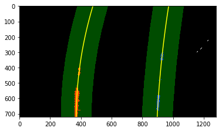

# Advanced Lane Line Project

This write up describes the Advanced Lane Line Project in eight sections shown below.

- Camera calibration
- Visualization of various color models
- Gradient and Direction thresholding
- Combining various thresholds to get best representation of lanes
- Perspective transformation
- Combining everything together in a pipeline
- Detecting lane lines
- Implement above Lane line detection using CLASS


## Section 1
### Camera calibration

Images taken by our camera undergo two types of distortion namely Radial distortion and tangential distortion. Radial distortion is caused by nonuniform bending of light around the edges of the camera lenses. And tangential distortion is caused when camera lense is not parallel to the image plane. These distortions make objects in image look different than they actually are. Same happens with images obtained from camera attached to a self driving car. Using these images without correcting for these distortions is not acceptable. 
OpenCV library offers camera calibrate and undistort functions for correcting images having such distortions. These functions remove distortion by using the dimensions of the known object and its dimensions in the image. This is best implemented using a Chessboard because of its high contrasting blocks and easy to find corners.
`cv2.findChessboardCorners` function finds corners of a chess board. Actual dimensions are saved in `object_points` and image dimensions using `image_points`.   
Using these object points and image points we ge the camera parameters using the function `cv2.calibrateCamera`. And finally we get the undistorted image using `cv2.undistort`.  
Result of camera calibration and image undistotion is shown below.


## Section 2
### Visualization of various color models

Image obtained from camera contains three different color channels namely, Red, Green and Blue. This is when we represent our image in RGB format. In HLS format these three channels represent Hue, Lightness and Saturation parameters of the image pixels. These channels have individial properties and varying characteristics in different conditions. We are discusing these channels here because characteristics of some of these channels might be of our interest for the task of Lane line detection. An example image is shown below in RGB and HLS formats with each channel separately shown.


As we can see Blue channels is blacked out in the area where there is yellow lane lines in the original image whereas Red and Green channels are giving good reflection of lane lines. L channel, as it is supposed to be, is bright at the spot of high intensity and vice versa and apparantly, S channel reflects the lane line very well, in fact, best of all the channels.  
After observing these channels we decide to use Red, Green, L and S channels in our project.

## Section 3
### Gradient and Direction thresholding

Apart from using different channels for lane detection, we also use the gradient information of the image. Gradient information gives us edges present in the image. These edges can be of various kinds. It can be corresponding to intensity variation, and object boundary, edges in an object itself etc. To distinguish lane line from all these edges we use the gradient and direction thresholds. As the lane lines are almost vertical, we apply Sobel operator only in X direction. Also directional threshold is set to match that of lane lines. We could have also used Sobel operator in X and Y direction both but the X direction alone was giving better results so i used it only.  
Output of Gradient and direction thresholding is show below.


## Section 4
### Combining various thresholds to get best representation of lanes

Now its time to combine the color channels and gradient and directional informations to best represent the lane lines. Red and Green channels are combined from RGB channel. L channel is used to include the brightness information. S channel is also included. The combination condition is given below.  
  
        `color_combined[(r_g_condition & l_condition) & (s_condition | combined_condition)] = 1`  
          
Where r_g_condition, l_condition, s_condition and combined_condition are threshold conditions that individual channels have to fulfill.  
Next step is to mask the unnecessary portion of the image. Cropped image is a triangle with base on left and right bottom image corners and apex as the midpoint of the image. Final result is shown below.


## Section 5
### Perspective transformation

Lane lines which are parallel on road look converging in image. This happens because objects farther away from camera apeear small and vice versa causing separation between lane lines decrease in our image causing them to look intersecting. To deal with this situation we apply perpective transform of our image and change the perspective to bird's eye view.  
This is done by using an image with straight lane lines, selecting four lane points in it and mapping them to a rectangle in a new image. The transformation matrix calculated using these points will then work equally well even when road curves.   
Image below shows the two perspectives.


## Section 6
### Combining everything together in a pipeline

Now its time to combine all the above steps starting from camera calibrate to unwarp to get final binary images depicting only the lane lines. After creating the pipeline and passing all the test images, results are as shown below.


## Section 7
### Detecting lane lines

Our next task is to decide which pixels in the binary output of pipeline are associated with lanes and if they are associated with lane then which lane they are associated to; left or right.  
Firstly, right and left lane points are distinguished on the basis of their location in the image. If they are located on the left half, they probably belong to left lane and vice versa. This assumption is a good way to detect the starting of lane line or we should say the 'x interscepts' of the lane lines. We implement this scheme by drawing a histogram of sum of pixel values along the columns. Image shown below, explains it better than words.


After getting the X-intercepts of the lane lines as starting points, we proceed by detecting lane indices in the vicinity of these starting points. Size of this vicinity is decided by the margin parameter. Image is devided in number of vertical slices called 'Windows'. If we visulaize these Windows and margins, we will see we are searching for vertices in rectangular areas shifting in x-direction with mean of detected points. This process apllied on an image is as show below.


This blind is not required at every frame. As the lane line will not shift much from one frame to the next; previous frame's fit's x-intercept will be a very good starting point for our lane search in the new frame. Applying the use of previous fit, we get following output. FYI, in the image below, we have not used the rectangular representation of search area rather represented and filled it using `cv2.fillPoly`



We now again transform our image back to the actual perspective and display the detected lane area with green colored polygon as shown below. Below image also contains Lane curvature and Offset from lane center written onto the image.  
Curvature radius is calculated using its mathematical expression. There is one thing that needs our attention and that is the relation between the image dimension and the actual dimension of the objects in the image. We first multiply all the indices with multiplying factor, then find new lane equations and use these new equations in the expression for curvature radius.
Offset from the lane center is nothing but the difference between the image center and average of x-intercepts of left and right lane lines.


## Section 8
### Implement above Lane line detection using CLASS

All the above steps above combined and applied on the project video works flawlessly. But for difficult situations, we need a tool that can check pipelines performance , do sanity checks and deal with bad frames. This can be implemented using Class.    

**Sanity checks** :   
We perform two sanity checks in our program.  
1). If Number of pixels detected for a particular line is less than 1500, that frame is declared as bad frame.  
2). If X-intercept of last fit used and current fit varies with more than a maximum limit, the frame is declared as bad frame.  
  
  
**Performance enhance** :  
We have data member named `self.detected` that keeps track whether tha lane is detected or not. If lane is not detected, we call the Blind search function to find the lane lines and if it is set to True, then we use the search function using previous fit.  
  
**Dealing with bad frames** :  
The `self.detected` member is not set to False every time we encounter a bad frame; rather, we set a maximum limit of 5 frames. If we encounter 5 succesive bad frames, we set the `self.detected ` to False and call the blind search function for lane detection.


## Discussion on the project

Advanced lane line project was a bit challenging but rewarding when completed. Personally, it has given a sense of amazement about what we can do with just a camera in the car. Surely, there is a lot more that we can do with camera. This project helped me getting an intution about camera calibration, undistortion, perspective transform, image gradients, and color channels. And finally integrating everything with Class, made the program more efficient and robust.  
Main challenge faced while doing this project was coming up with right strategy to get the best binary image from which lane pixels are to be detected. After exploring various color channels, gradient operators, and trying different values of thresholds and combination conditions, finally resulted in the presented results. One thing that i learned in this process, 'You should know when to use `cv2.imread()` and `mpimg.imread()`, if care is not taken, it will result in unexpected results '.  
  
**Possible Improvement**  
- One possible improvement might be to be able to dynamically decide the source and destination points for perspective transform. This will be useful when vehicle is going up or down a hill. In such condition, the orientation of vehicle can be used to decide the source and destination points.

- Another improvement will be to update one of the sanity checks in which we are comparing x-intercepts of previous fit and current fit, to know when lane change is taking place because when that happens, jumping of x-intercept of both left and right lane line will take place. 


```python

```
